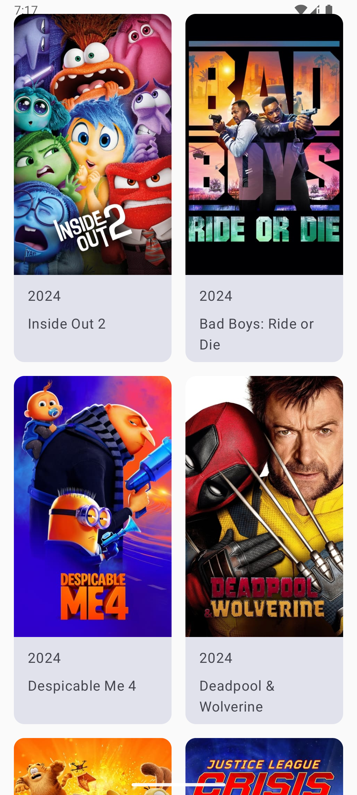

# Movies 3.0

by Roman Duda

[Techical Task](https://drive.google.com/file/d/1XRPsk6BeKV9-QTaApD9QrWCz7c_VzONB/view?usp=sharing)

Discover popular movies with Movies 3.0

This app implements:
    
    * MVVM
    * Compose for UI and navigation
    * Paging, Coroutines 
    * Retrofit for network requests
    * Dagger-Hilt for dependency injection
    * Coin for image loading
    
 
